# Memory Game
`version 1.1.0`

Play: <https://filipefrj.github.io/fend-project-memory-game/>

## Table of Contents

1. [Instructions](#instructions)
2. [Contributing](#contributing)
3. [How to Play](#how-to-play)
4. [Start The Game](#start-the-game)
5. [The Score Panel](#the-score-panel)
6. [Matching Cards](#matching-cards)
7. [Finishing The Game](#finishing-the-game)
8. [The Leaderboard](#the-leaderboard)
9. [Compatibility](#compatibility)
10. [Dependencies](#dependencies)
11. [Updates](#updates)

## Instructions

The starter project has some HTML and CSS styling to display a static version of the Memory Game project. You'll need to convert this project from a static project to an interactive one. This will require modifying the HTML and CSS files, but primarily the JavaScript file.

To get started, open `js/app.js` and start building out the app's functionality

For specific, detailed instructions, look at the project instructions in the [Udacity Classroom](https://classroom.udacity.com/me).

## Contributing

This repository is the starter code for _all_ Udacity students. Therefore, we most likely will not accept pull requests.

For details, check out [CONTRIBUTING.md](CONTRIBUTING.md).

## How to Play

The game is a classic **[Memory Game](https://filipefrj.github.io/fend-project-memory-game/)** with 16 cards, 8 pairs.

The player needs to match the 8 pairs to finish the game.

Finishing the game with the least number of mismatches and the shorter time will reward higher stars and rank on the leaderboard.

## Start the Game

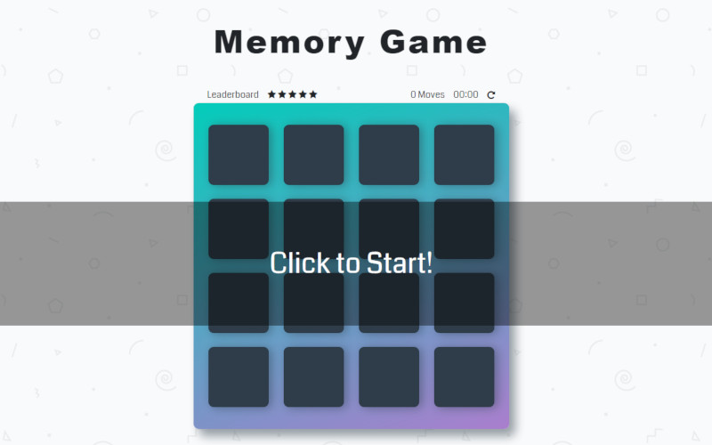

Click on the `Click to Start!` banner to start the game. After the banner is clicked, it disappears and the timer starts to track the elapsed time until you complete the game.

## The Score Panel

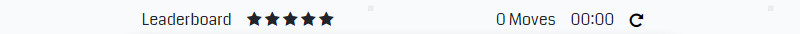

At the Score Panel there are 5 items:

* [Leaderboard](#leaderboard)
* [Star rating](#star-rating)
* [Moves](#moves)
* [Timer](#timer)
* [Restart button](#restart-button)

### Leaderboard

The `Leaderboard` item can be clicked at anytime before and after game starts, it takes the player to the Leaderboard table with the saved records standings. More details on the Leaderboard bellow.

### Star rating

`Stars` are rewarded based on the player's performance. Time and mismatched cards are taken into the evaluation of the star grading system. The stars decrease in real time while the game is being played.

### Moves

Every card opened counts as a `Move` and the number is displayed in real time during the game.

### Timer

The `Timer` displays the elapsed time during the game. It starts after the "Click to Start!" banner disappears and it stops when the eighth pair is matched.

### Restart button

Click on the `Restart` button at anytime to start a new game. The current game is interrupted and a new game is ready to be started again.

## Matching Cards

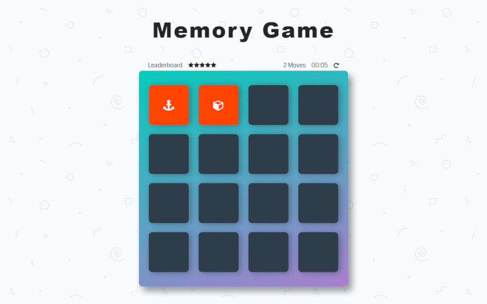

When cards are clicked, every pair is checked for matching cards. Different cards in a pair is a **mismatch**! Cards get red and they're turned back to the table. The player needs to memorize the cards in order to match them with future cards.

The mismatched cards are visible for 0.8s.

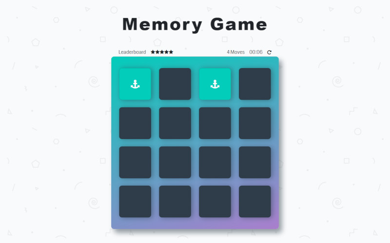

When both cards are of the same type, that's a **match**! Cards turn green and are kept opened in the table, leaving less cards available to be opened and allowing the player an easier way towards the end of the game.

Cards are shuffled every new game.

## Finishing the Game

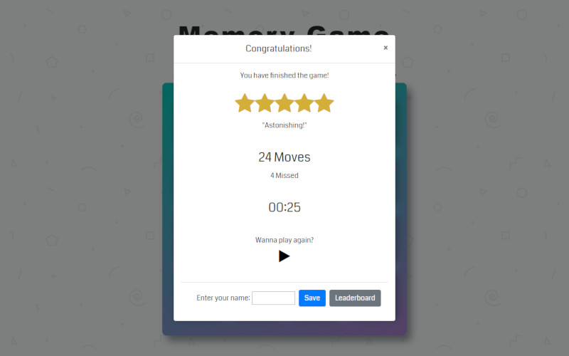

> "5 Stars! Astonishing!"

After finishing the game a `Congratulations!` screen shows the player's statistics. It contains the following information:

* [Stars](#stars)
* [Total Moves](#total-moves)
* [Match Time](#match-time)
* [Play Again](#play-again)
* [Save Game](#save-game)
* [Show Leaderboard](#show-leaderboard)

___
### Stars

That's the reward for the player's performance when completing the game with the least errors and the shortest time. The stars rewards are as follows:

|Stars|Errors|Time|
|:---:|:----:|:--:|
|5 stars|0 - 4|< 30s|
|4 stars|5 - 8|< 45s|
|3 stars|9 - 16|< 60s|
|2 stars|16 - 32|< 1:30|
|1 star|> 32|>= 1:30|

___
### Total Moves

The total moves do not influence the player's stars, they are displayed as a progress measurement during the game.

### Missed Moves

Bellow the total moves information it shows the number of missed pairs, the total number of mismatches. That's the most important information for the star rating and to move up the ranks at the leaderboard.

___
### Match Time

Indicates the total Match Time. This is the second most important information for the star rating and the leaderboard.

___
### Play Again

Click the `Play` button to start a new game without saving your record, without seeing the Leaderboard or without closing the Congratulations screen to see your cards again. This is a shortcut to play another match.

___
### Save Game

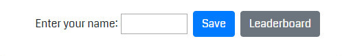

Type the player name on the input field and click `Save` button to save the record to local storage. This information is saved to the browser on the local machine. For now, the game doesn't support cross platform saving and ranking.

Maximum length 10 characters and minimum length 3 characters, special characters are accepted.

### Show Leaderboard

Click on `Leaderboard` button to view the leaderboard table. The Leaderboard will be displayed on the same screen.

___

## The Leaderboard

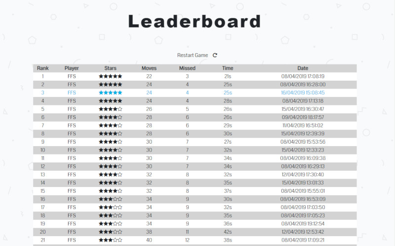

The Leaderboard shows all saved players statistics and ranks them based on a score system that produces a result similar to the star rating and uses the date as the tiebreaker. An earlier date will rank first, in which a player needs to overcome a previous recorded score to be on top of it.

The current player is always highlighted in blue. The highlight won't appear if you go to the leaderboard without completing a game and saving a new record.

### Restart Game

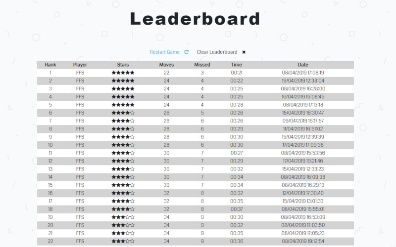

The `Restart Game` button takes the player for the initial screen, before the game starts.

### Clear Leaderboard

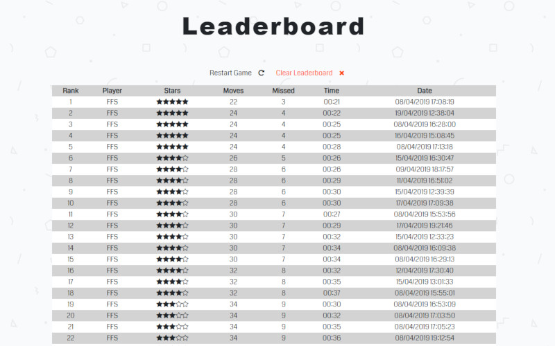

The `Clear Leaderboard` button allows you to erase all saved games data and start the leaderboard all over again. This is good if the leaderboard gets too long or if you just have too many bad games you want to delete from the rankings.

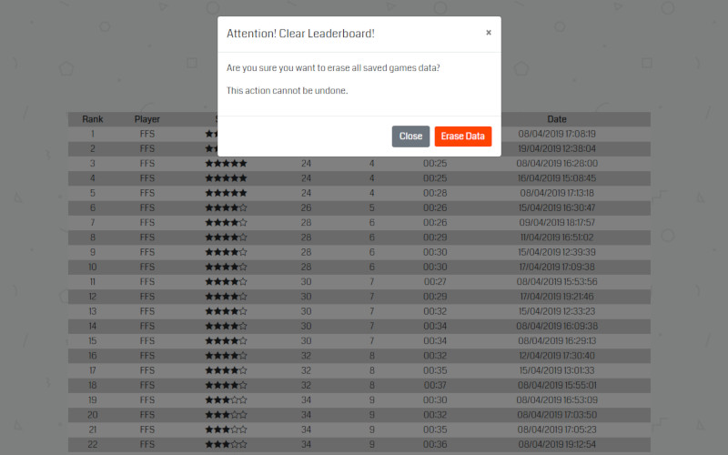

An alert message appears to confirm if the player really wants to erase all saved game records. Click `Close` to return to the leaderboard screen without applying any changes.

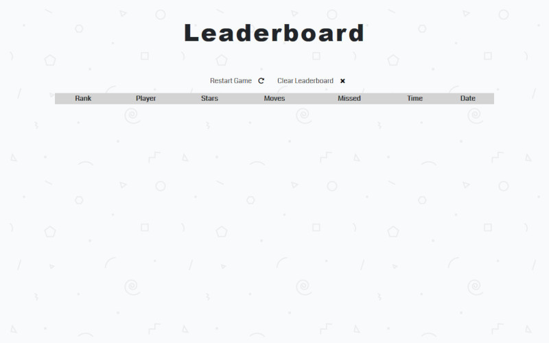

Clicking the `Erase Data` button will permanently erase the leaderboard and all saved games. And the player is ready to start all over again, maybe even inviting new players to build a new leaderboard.

> Good Game!

## Compatibility

* **Google Chrome** `73.0.3683.103` and above
* **Mozilla Firefox** `66.0.3` and above
* Probably working with previous versions of **Google Chrome** and **Mozilla Firefox**
* Not working properly with **Microsoft Internet Explorer**, **Microsoft Edge** and **Safari**

## Dependencies

* [Bootstrap `4.3.1`](https://getbootstrap.com/docs/4.3/getting-started/introduction/)
* [JQuery `3.3.1`](https://jquery.com/)
* [Popper.js `1.14.7`](https://popper.js.org/)

## Updates

Version 1.1.0

* Add `Clear Leaderboard` button to the leaderboard
* Change game time display format on the leaderboard